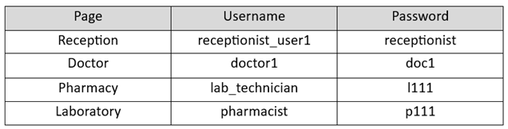

# Hospital Information System

# Introduction:
This is a web-based application for managing patients and their related information in a hospital. The core and necessary functionalities, such as reception, visit, laboratory, and pharmacy, have been implemented in this application.

# Technologies:
Microservices, Java, Spring boot, Spring cloud, Spring MVC,
Docker, Axon framework, Kafka, Keycloak, MySql, Hibernate, Thymeleaf, JavaScript, jQuery, Html and CSS

# Description:
This application is designed based on microservices principles and patterns such as CQRS, database-per-service, loose coupling, and autonomy, etc.
The following image illustrates the architecture and structure of the application.

# How To Run:
To run this project, Docker must be installed.
After installing Docker, run the run-me.sh file using Git Bash to create all the necessary Docker images. Then, it will run the containers using docker-compose.
To stop the application, just run "docker-compose -f docker-compose.yml down" in the project's root directory.

After ruuning the application, use the following usernames and passwords to access each part of the application:

